# 🏥 Physiotherapy Clinic Web Application

> **Confidential Client Project \| Portfolio & Interview Documentation**

A full-stack web application developed for a physiotherapy clinic to
provide a modern digital platform for presenting physiotherapy services,
showcasing professional information, collecting inquiries, and managing
appointment requests.

The project demonstrates practical experience in **React.js, Python,
Django, Django REST Framework, REST API integration, database-driven
application development, authentication, responsive UI design, form
handling, and full-stack architecture**.

> **🔒 Confidentiality Notice**
>
> This README is prepared for portfolio and interview purposes. Client
> identity, personal information, patient information, private business
> information, production credentials, API keys, private URLs, and other
> sensitive details have intentionally been excluded.

------------------------------------------------------------------------

## 📌 Project Overview

The Physiotherapy Clinic Web Application provides a professional online
experience for visitors while supporting appointment-related workflows.

The demonstrated application includes:

-   Modern healthcare-focused landing page
-   Physiotherapy service presentation
-   Treatment/service categories
-   Physiotherapist profile section
-   Testimonials/reviews section
-   Contact and inquiry form
-   Appointment booking form
-   Date selection
-   Preferred time selection
-   Service selection
-   Appointment details collection
-   Responsive navigation
-   Responsive page layouts
-   Backend-driven form and appointment workflows
-   Administrative functionality
-   Secure application architecture

The application is designed around a **frontend + backend + database
architecture**.

------------------------------------------------------------------------

# 🎯 Project Objectives

The main objectives of the project were to:

-   Build a professional online presence for a physiotherapy practice.
-   Present physiotherapy services in a clear and structured way.
-   Provide visitors with information about available treatments.
-   Showcase physiotherapist/professional information.
-   Provide an online appointment request workflow.
-   Allow users to select a preferred date and time.
-   Collect required appointment information through a structured form.
-   Provide a dedicated contact/inquiry workflow.
-   Create a responsive experience across desktop, tablet, and mobile
    devices.
-   Build a maintainable full-stack application architecture.
-   Provide a foundation for future healthcare-management features.

------------------------------------------------------------------------

# ✨ Key Features

## 🏠 1. Modern Home Page

The landing page provides a clear introduction to the physiotherapy
service and directs users toward the primary actions.

### Highlights

-   Professional healthcare-oriented design
-   Hero section
-   Primary appointment call-to-action
-   Services navigation
-   Responsive layout
-   Supporting imagery
-   Trust/review indicators

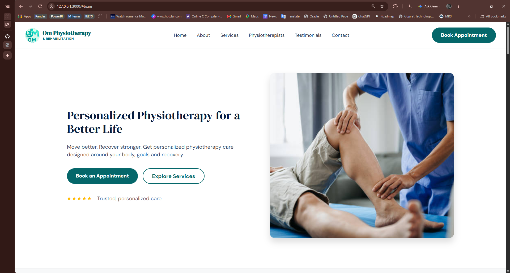

------------------------------------------------------------------------

# 🩺 2. Physiotherapy Services

The application presents physiotherapy services in dedicated sections.

The demonstrated service categories include areas such as:

-   Pain & Orthopedic Care
-   Rehabilitation
-   Advanced Physiotherapy
-   Specialized Care

The service section provides users with a structured overview of
treatment areas without exposing confidential business information.

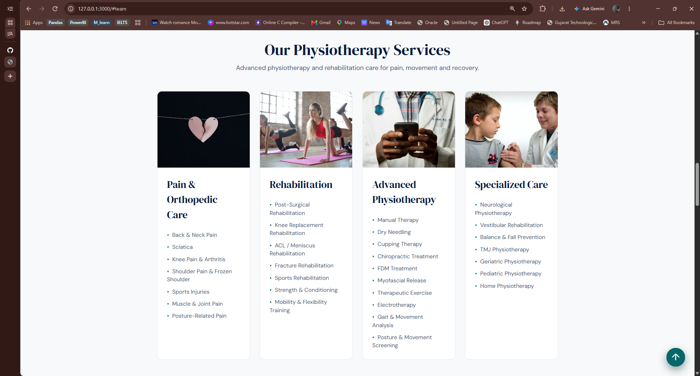

------------------------------------------------------------------------

# 👨‍⚕️ 3. Physiotherapist Profiles

The website includes a dedicated section for
physiotherapist/professional profiles.

The profile presentation can include:

-   Professional photograph
-   Professional title
-   Qualifications
-   Experience information
-   Professional background
-   Areas of practice


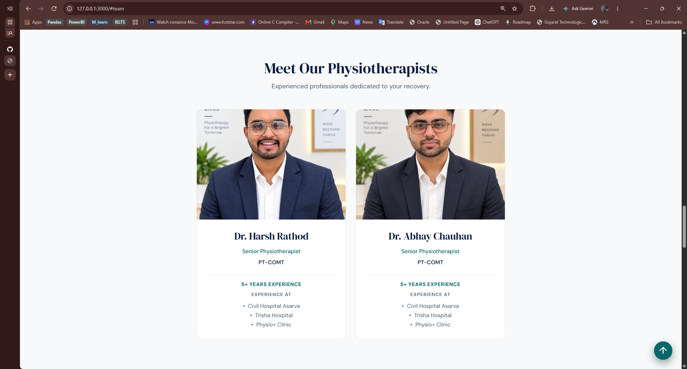

------------------------------------------------------------------------

# ⭐ 4. Testimonials & Reviews

The website contains a testimonial/review section designed to provide
visitors with social proof and an overview of patient/client
experiences.

The UI supports:

-   Review cards
-   Star ratings
-   Multiple testimonials
-   Responsive testimonial layout

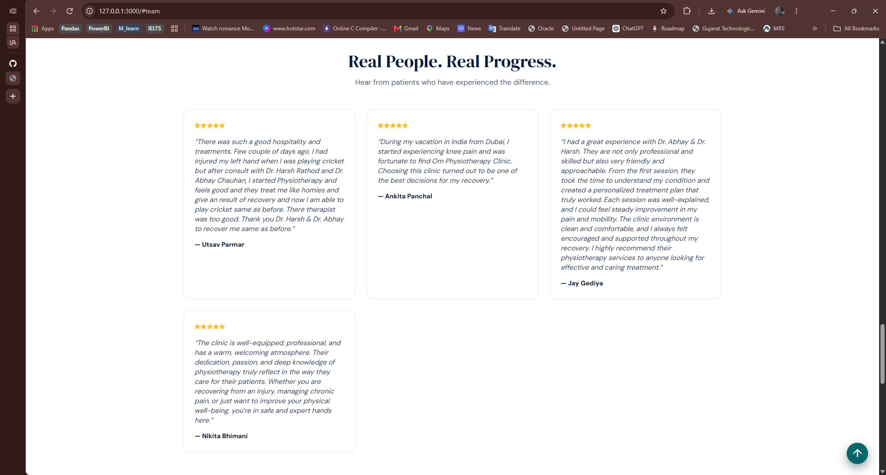


------------------------------------------------------------------------

# 📞 5. Contact & Inquiry System

A dedicated contact section allows visitors to submit an inquiry.

The demonstrated form includes fields such as:

-   Full Name
-   Email
-   Phone
-   Subject
-   Message

The application provides a structured way for visitors to communicate
with the clinic.

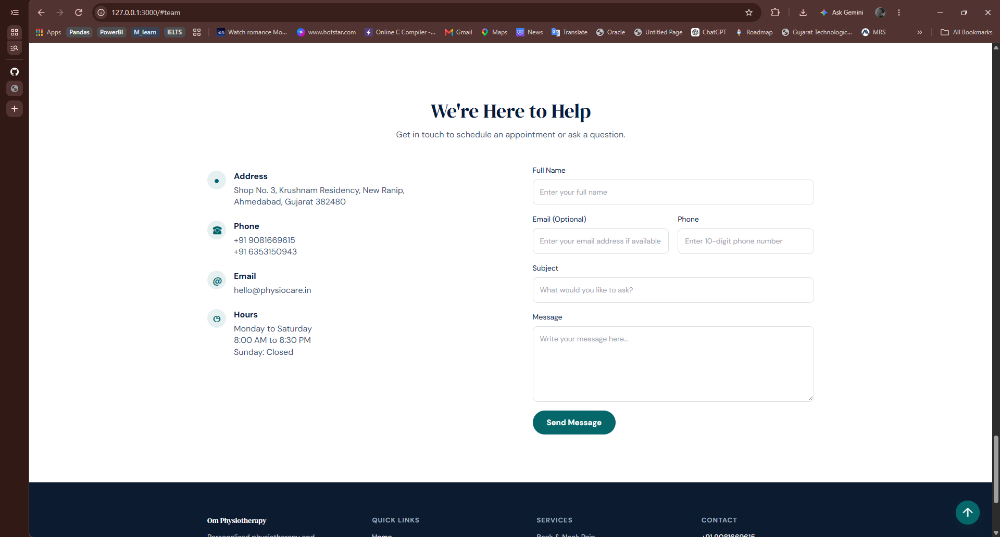

------------------------------------------------------------------------

# 📅 6. Appointment Booking System

A core feature of the application is the appointment booking workflow.

Visitors can provide the required information and request an
appointment.

### Booking Workflow

``` text
Visitor
   │
   ▼
Book Appointment
   │
   ▼
Enter Personal Details
   │
   ▼
Select Service
   │
   ▼
Select Preferred Date
   │
   ▼
Select Preferred Time
   │
   ▼
Add Optional Notes
   │
   ▼
Submit Appointment Request
   │
   ▼
Booking Confirmation / Processing
```

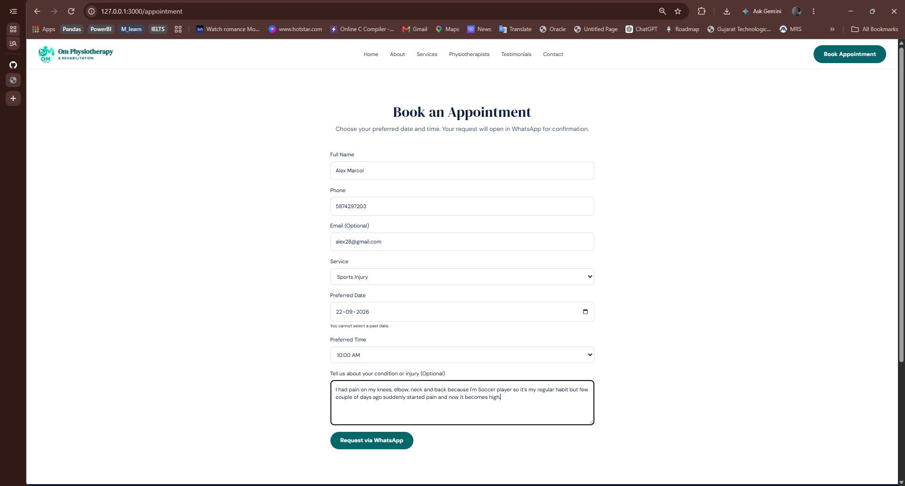

------------------------------------------------------------------------

# 🕐 7. Appointment Time Selection

The appointment interface provides a structured time-selection workflow.

The UI presents available/preferred appointment times in a user-friendly
format.

This helps make the booking process more structured and reduces
ambiguity when users request an appointment.

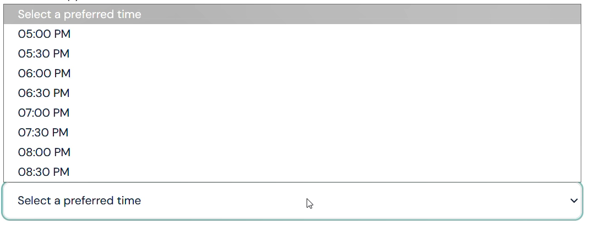


------------------------------------------------------------------------

# 📝 8. Appointment Details

The appointment form supports the collection of information required to
process an appointment request.

Typical information includes:

-   Full name
-   Phone number
-   Optional email
-   Selected service
-   Preferred date
-   Preferred time
-   Additional condition/inquiry information

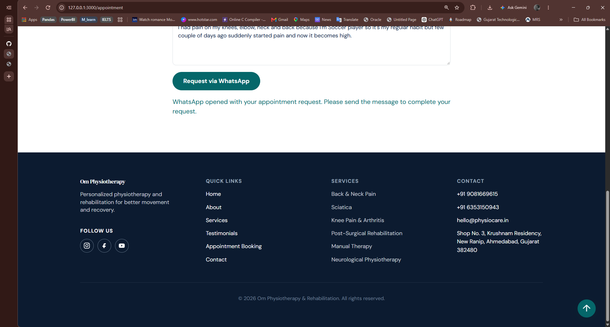


------------------------------------------------------------------------

# 🔐 9. Administrative Functionality

The application includes administrative functionality for managing
appointment-related operations.

Depending on the configured implementation, administrative capabilities
can include:

-   Secure administrator authentication
-   Appointment management
-   Appointment status updates
-   Appointment details
-   Availability management
-   Inquiry management
-   Dashboard functionality

Production credentials and private administrative information are
intentionally excluded.

------------------------------------------------------------------------

# 🏗️ System Architecture

The application follows a layered full-stack architecture.

``` text
                         ┌─────────────────────┐
                         │        User         │
                         │  Desktop / Mobile   │
                         └──────────┬──────────┘
                                    │
                                    ▼
                         ┌─────────────────────┐
                         │    React Frontend   │
                         │                     │
                         │ UI / Components     │
                         │ Pages / Forms       │
                         │ Responsive Design   │
                         └──────────┬──────────┘
                                    │
                              REST API / HTTP
                                    │
                                    ▼
                         ┌─────────────────────┐
                         │   Django REST API   │
                         │                     │
                         │ Business Logic      │
                         │ Validation          │
                         │ Authentication      │
                         └──────────┬──────────┘
                                    │
                                    ▼
                         ┌─────────────────────┐
                         │      Database       │
                         │                     │
                         │ Appointments        │
                         │ Availability        │
                         │ Application Data    │
                         └─────────────────────┘
```

------------------------------------------------------------------------

# 🧰 Technology Stack

## Frontend

-   React.js
-   JavaScript / TypeScript
-   HTML5
-   CSS3
-   Responsive Web Design
-   REST API Integration

## Backend

-   Python
-   Django
-   Django REST Framework

## Database

-   SQL-based relational database

## Development Tools

-   Git
-   GitHub
-   npm
-   pip
-   Python Virtual Environment
-   Visual Studio Code

------------------------------------------------------------------------

# 🔄 Frontend--Backend Communication

The frontend communicates with the backend through REST APIs.

``` text
React.js
   │
   │ HTTP Request
   ▼
Django REST Framework
   │
   │ Validation / Business Logic
   ▼
Database
   │
   │ Response
   ▼
Django REST Framework
   │
   ▼
React.js
```

This separation allows the frontend and backend to be developed and
maintained independently.

------------------------------------------------------------------------

# 📂 Project Structure

A simplified representation of the application:

``` text
physio-clinic/
│
├── frontend/
│   ├── src/
│   │   ├── components/
│   │   ├── pages/
│   │   ├── services/
│   │   ├── assets/
│   │   └── ...
│   │
│   ├── public/
│   └── package.json
│
├── backend/
│   ├── manage.py
│   ├── project/
│   ├── apps/
│   ├── models/
│   ├── serializers/
│   ├── views/
│   └── ...
│
├── docs/
│   └── screenshots/
│
├── .gitignore
└── README.md
```


------------------------------------------------------------------------

# 🗄️ Database Design

The backend uses a relational database to manage application
information.

A simplified appointment model can be represented as:

``` text
Appointment
│
├── Date
├── Time
├── Status
├── Service
├── User / Visitor Information
├── Additional Notes
└── Created Timestamp
```

Supporting application entities may include:

-   Services
-   Appointment availability
-   Contact inquiries
-   Administrative users
-   Website content

Actual production schemas, records, and confidential data are not
included.

------------------------------------------------------------------------

# 📱 Responsive Design

The application is designed to work across:

-   💻 Desktop
-   💻 Laptop
-   📱 Mobile
-   📲 Tablet

### Responsive Design Considerations

-   Flexible layouts
-   Responsive navigation
-   Mobile-friendly forms
-   Adaptive appointment interface
-   Touch-friendly controls
-   Responsive service cards
-   Responsive testimonial sections
-   Optimized content presentation

------------------------------------------------------------------------

# 🎨 UI / UX Design

The interface focuses on a clean healthcare-oriented experience.

### Design Principles

-   Simple navigation
-   Clear calls to action
-   Consistent typography
-   Structured information hierarchy
-   Accessible forms
-   Responsive components
-   Clear appointment workflow
-   Consistent visual design

The main user journey is intentionally kept straightforward:

``` text
Discover
   ↓
Explore Services
   ↓
Build Trust
   ↓
Contact / Book Appointment
   ↓
Submit Request
```

------------------------------------------------------------------------

# 🧩 Challenges & Technical Solutions

## 1. Appointment Availability

### Challenge

Users need to select a suitable appointment time without creating
conflicting bookings.

### Approach

The application uses structured appointment date/time handling and
backend validation to process appointment requests.

------------------------------------------------------------------------

## 2. Responsive Appointment Interface

### Challenge

The appointment workflow must remain easy to use on smaller screens.

### Approach

Responsive layouts, reusable components, and adaptive form controls were
used to maintain usability across devices.

------------------------------------------------------------------------

## 3. Frontend--Backend Integration

### Challenge

The React frontend needs to communicate reliably with the Django
backend.

### Approach

REST APIs were used to maintain a clear separation between presentation,
business logic, and data management.

------------------------------------------------------------------------

## 4. Administrative Security

### Challenge

Administrative operations should not be publicly accessible.

### Approach

Protected authentication and authorization mechanisms are used for
administrative functionality.

------------------------------------------------------------------------

## 5. Form Validation

### Challenge

Appointment and contact forms require valid and complete information.

### Approach

Validation is handled at the appropriate frontend and backend layers to
improve data quality and application reliability.

------------------------------------------------------------------------

# 🔑 Security & Privacy

Security and privacy are important considerations for a
healthcare-related application.

The project follows practices such as:

-   Password hashing
-   Authentication
-   Authorization
-   Protected administrative routes
-   API validation
-   Server-side validation
-   Environment variables
-   Secure credential handling
-   Separation of frontend and backend responsibilities
-   Avoiding hard-coded secrets

### Sensitive Information Excluded

This portfolio repository intentionally excludes:

-   Patient names
-   Patient medical information
-   Patient contact information
-   Private clinic information
-   Real appointment records
-   Passwords
-   API keys
-   Secret keys
-   Database credentials
-   Authentication tokens
-   Private production URLs
-   Internal infrastructure details

------------------------------------------------------------------------

# 🧪 Testing

The application can be tested across multiple layers.

## Frontend Testing

-   Navigation
-   Responsive layouts
-   Forms
-   Appointment interface
-   API integration
-   Error handling

## Backend Testing

-   API endpoints
-   Database operations
-   Authentication
-   Authorization
-   Validation
-   Appointment logic

## Integration Testing

-   Frontend ↔ Backend communication
-   Appointment submission
-   Availability handling
-   Contact form submission
-   Administrative operations

------------------------------------------------------------------------

# 📊 Development Workflow

The project followed a structured development approach:

``` text
Requirement Analysis
        │
        ▼
UI / UX Design
        │
        ▼
Frontend Development
        │
        ▼
Backend Development
        │
        ▼
Database Integration
        │
        ▼
Authentication
        │
        ▼
Appointment System
        │
        ▼
API Integration
        │
        ▼
Testing & Validation
        │
        ▼
Deployment / Maintenance
```

------------------------------------------------------------------------

# 🎥 Project Demo

A project demonstration video is included separately from this README.

### Demo

[▶️ Watch Project Demo](./PhysioClinic/Images/Demo_Video.mp4)

For a GitHub repository, the recommended structure is:

``` text
docs/
├── screenshots/
│   ├── 01-home-page.png
│   ├── 02-services-page.png
│   ├── 03-physiotherapists-page.png
│   ├── 04-testimonials-page.png
│   ├── 05-contact-page.png
│   ├── 06-appointment-form.png
│   ├── 07-appointment-time-slots.png
│   └── 08-appointment-details.png
│
└── demo/
    └── physio-clinic-demo.mp4
```

------------------------------------------------------------------------

# 🖼️ Project Screenshots

The README includes selected screenshots captured from the project
demonstration.

### Home Page


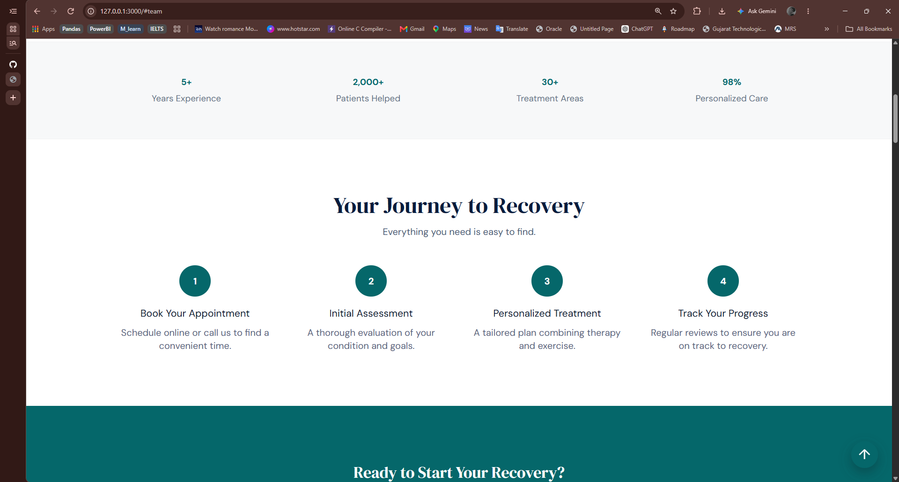
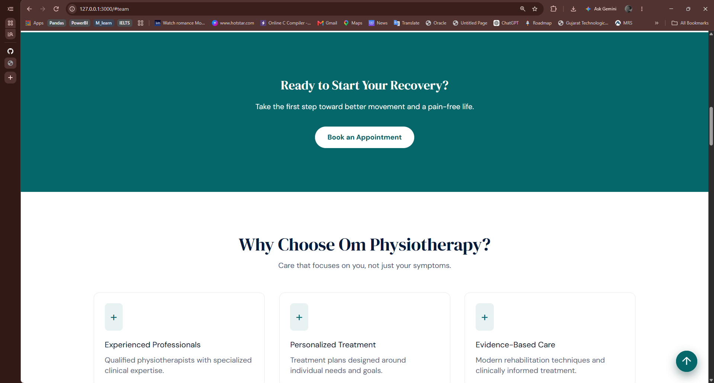

### About

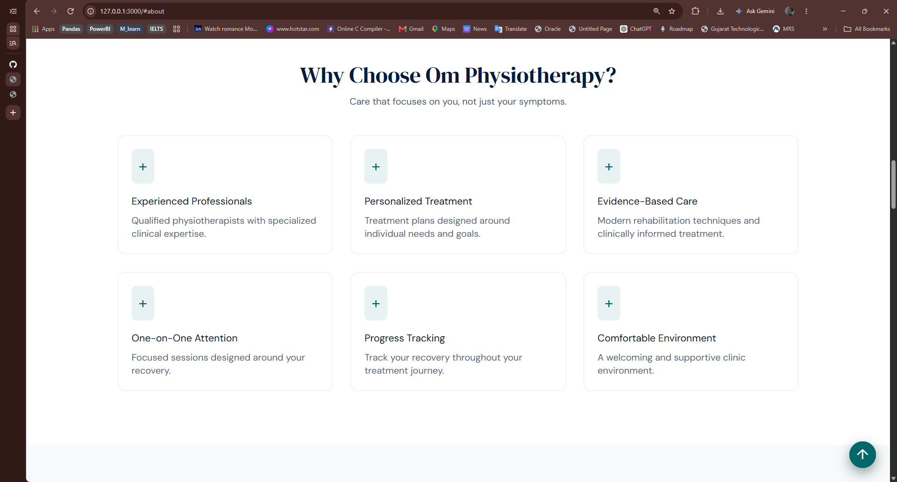

### Services


### Physiotherapist Profiles


### Testimonials


### Contact


### Appointment Booking


### Appointment Time Selection


### Appointment Details


------------------------------------------------------------------------

# 🚀 Future Enhancements

Potential future improvements include:

-   WhatsApp appointment notifications
-   Automated email notifications
-   Appointment reminders
-   Calendar synchronization
-   Online payment integration
-   Patient accounts
-   Treatment history management
-   Advanced analytics dashboard
-   Role-based access control
-   Appointment reporting
-   Progressive Web App support

These enhancements depend on future requirements and privacy
considerations.

------------------------------------------------------------------------

# 📈 Learning Outcomes

This project provided practical experience in:

-   Full-stack web development
-   React.js
-   Python
-   Django
-   Django REST Framework
-   REST API architecture
-   Database-driven application development
-   Authentication
-   Authorization
-   Appointment scheduling logic
-   Form validation
-   Responsive UI development
-   Frontend-backend integration
-   Git and GitHub
-   Software architecture
-   Real-world application development
-   Confidential project handling

------------------------------------------------------------------------

# 💼 Skills Demonstrated

### Programming & Development

-   Python
-   JavaScript
-   React.js
-   Django
-   Django REST Framework
-   HTML5
-   CSS3

### Backend & API

-   REST API Development
-   API Integration
-   Authentication
-   Authorization
-   Server-side Validation
-   CRUD Operations

### Database

-   SQL
-   Relational Database Design
-   Data Modeling
-   Database Integration

### Frontend

-   Responsive Design
-   Component-Based Architecture
-   Form Development
-   API Integration
-   UI/UX Implementation

### Development Practices

-   Git
-   GitHub
-   Modular Architecture
-   Environment Configuration
-   Secure Credential Management

------------------------------------------------------------------------

# 📌 Project Information

  Category         Details
  ---------------- -----------------------------------------
  Project Type     Full-Stack Web Application
  Domain           Healthcare / Physiotherapy
  Primary Focus    Clinic Website & Appointment Management
  Frontend         React.js
  Backend          Python / Django
  API              Django REST Framework
  Database         SQL
  Architecture     Full-Stack / REST API
  UI               Responsive Web Design
  Project Status   Completed

------------------------------------------------------------------------

# 🔒 Confidentiality

This project was developed in a private client/business environment.

For portfolio and interview purposes, the following information has
intentionally been excluded:

-   Client / clinic identity
-   Doctor or staff personal information
-   Patient information
-   Patient medical records
-   Personal contact information
-   Private business information
-   Production credentials
-   API keys
-   Secret keys
-   Database credentials
-   Authentication tokens
-   Private URLs
-   Internal infrastructure
-   Confidential documents
-   Sensitive source code
-   Real appointment records

Any screenshots, videos, or demonstrations published with this project
should contain only approved or dummy data.

------------------------------------------------------------------------

# 📄 License

This project is proprietary and confidential.

The source code, design, assets, and implementation are not intended for
unauthorized redistribution, reproduction, modification, or commercial
use.

------------------------------------------------------------------------

# 👨‍💻 Developer

Developed as a full-stack web development project with a focus on:

**React.js • Python • Django • Django REST Framework • SQL • REST APIs •
Responsive UI**

Additional technical projects and development work can be presented
through the developer's portfolio and GitHub profile.

------------------------------------------------------------------------

# ⭐ Note for Recruiters & Interviewers

This project demonstrates practical experience in converting real-world
requirements into a functional full-stack web application.

The project covers the complete development lifecycle, including:

-   Requirement understanding
-   UI/UX implementation
-   Frontend development
-   Backend development
-   REST API development
-   Database integration
-   Authentication
-   Appointment workflow
-   Responsive design
-   Testing
-   Confidentiality and secure handling of project information

Due to confidentiality requirements, certain project-specific and
production details have intentionally been omitted.

The documentation focuses on the **technical architecture,
functionality, development approach, technologies, and engineering
concepts** used in the project without exposing private client
information.

------------------------------------------------------------------------

## ⭐ Project Highlights

``` text
✔ Full-Stack Architecture
✔ React.js Frontend
✔ Django Backend
✔ Django REST Framework
✔ REST API Integration
✔ Appointment Booking
✔ Appointment Time Selection
✔ Contact & Inquiry Form
✔ Physiotherapy Services
✔ Professional Profiles
✔ Testimonials / Reviews
✔ Responsive UI
✔ Authentication & Authorization
✔ Database Integration
✔ Secure Configuration
✔ Real-World Project Experience
```

------------------------------------------------------------------------

> **Built with modern full-stack technologies and designed with
> scalability, usability, security, and maintainability in mind.**
